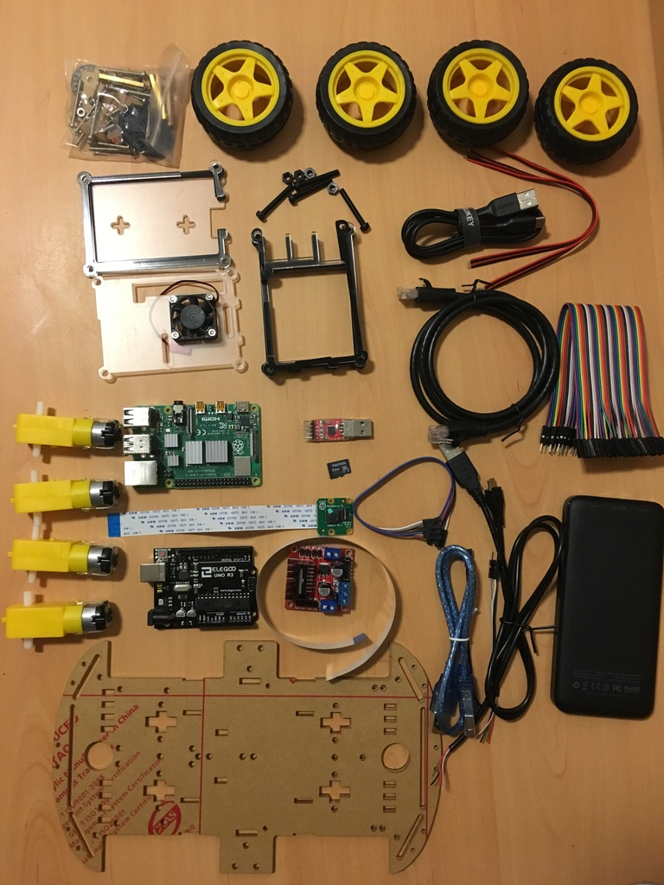
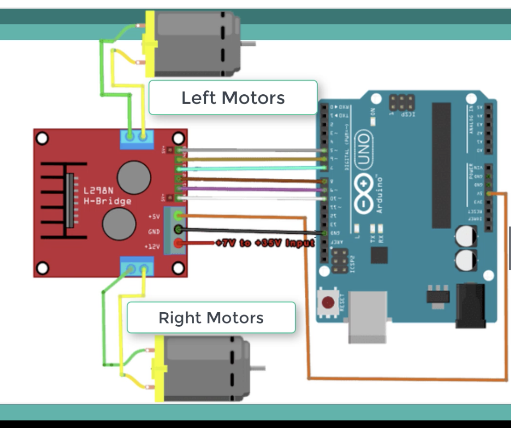
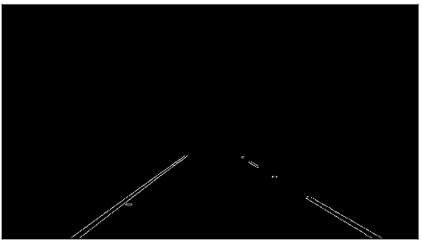
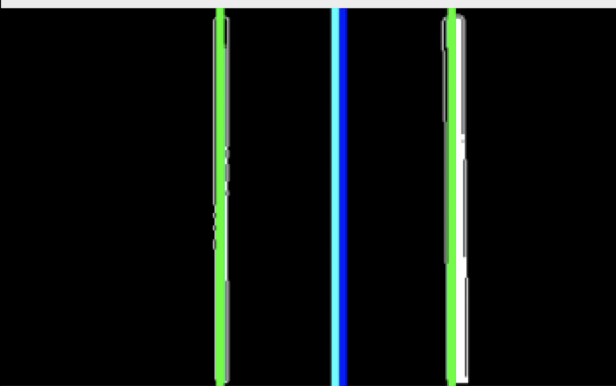
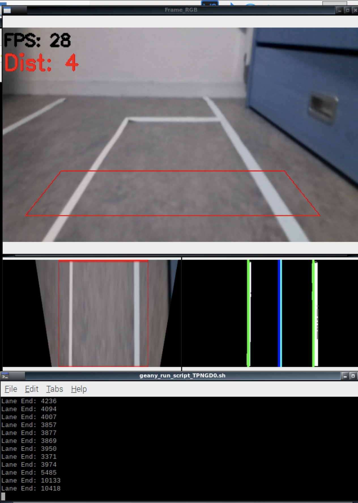
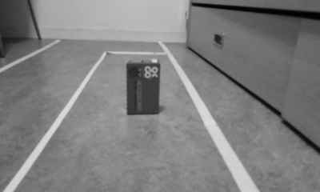
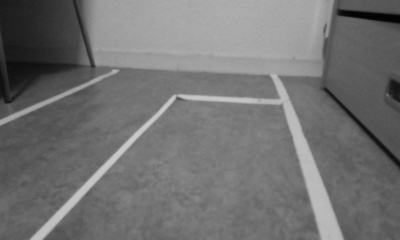

#Autonomous Car (Mini-Prototype)

Self-Driving Car with the feature of Line detection, obstacle avoidance, and obstacle recognition.  

__Keywords__: Autonomous, [RaspberryPi](https://www.raspberrypi.org), [Arduino](https://www.arduino.cc), C/C++, [OpenCV](https://opencv.org), [Computer Vision](https://www.pcmag.com/news/what-is-computer-vision)


[](https://opensource.org/licenses/MIT) 


Table of contents
=================

<!--ts-->
* [Description](#description)
* [Car Parts](#car-parts)
* [Programming](#programming)
* [Scheme of System and Connections](#scheme-of-system-and-connections)
* [Line-Detection](#line-detection)
* [Obstacle Avoidance and Road Sign Recognition](#obstacle-avoidance-and-road-sign-recognition)
<!--te-->


##Description
In this repository, I will share my journey of building a minimal self driving car. This project inspired by the dream of buidilding real-scale self driving car only by using cameras to make accessible for more people in the future. 
So that, only 8 Mp Raspberry-Camera was used for real-time image processing, and no sensor used for car navigations or data gathering.The car has following future.
Futures of the car:

   * Line Detection
   * Obstacle Avoidance
   * Road Sign Recognition 
   
   [](https://youtu.be/WiadMunX-Qo)


##Car Parts
   
   
Here is the list of parts and their links:
   * [Raspberry Pi 4 Model B](https://www.raspberrypi.org/products/raspberry-pi-4-model-b/)
   * [Ardunio UNO R3](https://www.amazon.com/Arduino-A000066-ARDUINO-UNO-R3/dp/B008GRTSV6/ref=sr_1_2?dchild=1&keywords=arduino+uno+r3&qid=1590056138&sr=8-2)
   * [H-Bridge Motor Drive Controller](https://www.amazon.com/Qunqi-Controller-Module-Stepper-Arduino/dp/B014KMHSW6/ref=sr_1_13?dchild=1&keywords=l298n&qid=1590055578&sr=8-13)
   * [Raspberry Pi Camera Module V2 8Mp](https://www.amazon.com/LABISTS-Raspberry-Camera-Official-8-megapixel/dp/B07W6THFPH/ref=sr_1_3?dchild=1&keywords=Raspberry+Pi+Official+Camera+Module+V2+8Mp&qid=1590056224&sr=8-3)
   * [Solar Power Bank](https://www.amazon.com/Portable-Rain-resistant-Dirtproof-Shockproof-Usb-charged/dp/B0114DVIJ8/ref=sr_1_284?crid=T49PBCTD7TV0&dchild=1&keywords=solar+power+bank&qid=1590055903&sprefix=solar+power+%2Caps%2C234&sr=8-284)
   * [Robot Smart Car Chassis Kits](https://www.amazon.com/wheel-layer-Chassis-Encoder-Arduino/dp/B06VTP8XBQ/ref=sr_1_8?dchild=1&keywords=Telaio+car+Chasis&qid=1590056420&sr=8-8)
   * [Mini HDMI to HDMI cable](https://www.amazon.com/AmazonBasics-High-Speed-Mini-HDMI-Adapter-Cable/dp/B014I8UEGY/ref=sr_1_4?crid=1K9KA4S9HT332&dchild=1&keywords=mini+hdmi+to+hdmi+cable&qid=1590055969&sprefix=mini+hdmi%2Caps%2C235&sr=8-4)
   * [USB C Cable](https://www.amazon.com/AUKEY-Braided-Charging-Samsung-Nintendo/dp/B087CK9DW1/ref=sr_1_37_sspa?dchild=1&keywords=usb+c+cable&qid=1590056275&sr=8-37-spons&psc=1&spLa=ZW5jcnlwdGVkUXVhbGlmaWVyPUEyVVUzVUU4NThMRkpXJmVuY3J5cHRlZElkPUEwMzgyOTA5Mk9ZQjExSUgyNlI0ViZlbmNyeXB0ZWRBZElkPUEwMTIzNTk2MklZMEZRU1YxOE8zQSZ3aWRnZXROYW1lPXNwX2J0ZiZhY3Rpb249Y2xpY2tSZWRpcmVjdCZkb05vdExvZ0NsaWNrPXRydWU=)
   * [Pi Camera Cable](https://www.amazon.com/dp/B087FDJ2RP/ref=sspa_dk_detail_0?psc=1&pd_rd_i=B087FDJ2RP&pd_rd_w=UFblC&pf_rd_p=48d372c1-f7e1-4b8b-9d02-4bd86f5158c5&pd_rd_wg=ka3sE&pf_rd_r=WFER4SYA991ZMK65R737&pd_rd_r=10202d0a-7844-4b4f-8890-1ac7879482c7&spLa=ZW5jcnlwdGVkUXVhbGlmaWVyPUExQ1FNTFpCS1JER0FJJmVuY3J5cHRlZElkPUEwNjk3NzM3MUk0N1FIMUhHUDhZNyZlbmNyeXB0ZWRBZElkPUEwMzQ4MDEwMUM0SklBUVU3RldDSiZ3aWRnZXROYW1lPXNwX2RldGFpbCZhY3Rpb249Y2xpY2tSZWRpcmVjdCZkb05vdExvZ0NsaWNrPXRydWU=)
   * [Ribbon Cables](https://www.amazon.com/EDGELEC-Breadboard-Optional-Assorted-Multicolored/dp/B07GD2BWPY/ref=pd_bxgy_img_2/144-5025298-3910300?_encoding=UTF8&pd_rd_i=B07GD2BWPY&pd_rd_r=43f96d05-a664-4ea1-adfd-b25332599e2c&pd_rd_w=HNeuE&pd_rd_wg=1ML6U&pf_rd_p=4e3f7fc3-00c8-46a6-a4db-8457e6319578&pf_rd_r=RXYTRXHNBGHBZ4SN6SMG&psc=1&refRID=RXYTRXHNBGHBZ4SN6SMG)
   
## Programming

Main programming language of the project is `C++` and arduino programming(`C language`). For the image capturing and processing, as well as Computer Vision algorithms open source `OpenCV` C++ library was used.
Firstly, Ardunio programmed and tested without any master device(in this project Raspberry Pi). The motion of the car is achieved by changing signal value (0 to 255 - 255 highest voltage). Arduino pins are declared and speed of the car for each instruction defined. 
``` 
    //Left side of Motors
    const int EnL = 5;  # Pin Numbers on Arduino
    const int HighL = 7;
    const int LowL = 11;
    
    //Right side of Motors
    const int EnR = 6;
    const int HighR = 9;
    const int LowR = 8;
    
    //Forward Motion
    void Forward(){
      digitalWrite(HighL, HIGH);
      digitalWrite(LowL, LOW);
      digitalWrite(HighR, HIGH);
      digitalWrite(LowR, LOW);
      analogWrite(EnL, 250);
      analogWrite(EnR, 250);
}
```
Since there is no steering in the car, also changing directions of car achieved by giving reverse voltage values on each side of car motors. Example:
```
    //Steering to right softly
    void Right_soft(){
      digitalWrite(HighL, LOW);
      digitalWrite(LowL, HIGH);
      digitalWrite(HighR, LOW);
      digitalWrite(LowR, HIGH);
      analogWrite(EnR,255);
      analogWrite(EnL,255);
      delay(1000);
    
      digitalWrite(HighL, LOW);
      digitalWrite(LowL, HIGH);
      digitalWrite(HighR, HIGH);
      digitalWrite(LowR, LOW);
      analogWrite(EnR,255);
      analogWrite(EnL,255);
      delay(200);
     }
```

After defining the motion, raspberryPi connected booted and configured ([command list](Commands%20for%20Raspberrypi.txt)) for SSH connection, C++ ide setups, Camera setups. For all image capturing and processingi OpenCV was the primary library and for any data manupulation and processing stl containers was used [Standard Template Library](https://www.geeksforgeeks.org/the-c-standard-template-library-stl/)
* Example Code for Camera Setup and Region of Interest:

   ```
    void Setup (int argc, char **argv, RaspiCam_Cv &Camera){
        Camera.set( CAP_PROP_FRAME_WIDTH,("-w", argc, argv, 400));
        Camera.set( CAP_PROP_FRAME_HEIGHT, ("-h", argc, argv, 240));
        Camera.set( CAP_PROP_BRIGHTNESS, ("-br", argc, argv, 50));
        Camera.set( CAP_PROP_CONTRAST, ("-co", argc, argv, 50));
        Camera.set( CAP_PROP_SATURATION, ("-sa", argv, argc, 50));
        Camera.set( CAP_PROP_GAIN, ("-g", argc, argv, 50));
        Camera.set( CAP_PROP_FPS, ("-fps", argc, argv,0));
        }
    void RegionofInterest(){
        line(Frame,Source[0], Source[1], Scalar(0,0,255), 1);
        line(Frame,Source[1], Source[3], Scalar(0,0,255), 1);
        line(Frame,Source[3], Source[2], Scalar(0,0,255), 1);
        line(Frame,Source[2], Source[0], Scalar(0,0,255), 1);
  
        //Perspective transformation of Region of interest
        Matrix = getPerspectiveTransform(Source, Destination);   
        
        warpPerspective(Frame,FramePerspective, Matrix, Size(400,240));
        }
  ``` 
[Check Codes](Code)

## Scheme of System and Connections
As can be seen from the circuit scheme below, the connection between motors and arduino is made through H-Bridge in order to control the left and right motors separately. H-Bridge is connected to power supply, arduino and motors. 

RaspberryPi is used as master device and arduino as sleeve device so raspberry pi is connected to power supply and arduino which sends the changing signal through declared and connected pins.


## Line-Detection

The lane detection pipeline steps:

 1. Pre-processing images using grayscale
 2. Applying canny edge detection to the image
 3. Applying masking region to the image
 
  
  
 4. Applying Hough transform to the image
 
  
  
 5. Extrapolating the lines found in the hough transform to construct the left and right lane lines
 6. Adding the extrapolated lines to the input image
 7. Finding the center of lines for navigation
  
    
Final output of this process detects line and centers the car navigation in the lines. 
Since the algorithm use the density of line in white, line density is higher in the lines end so the line ends can be detected. 
Also car can navigate and center itself based on the positive and negative values of difference between line center and frame-center
    

## Obstacle Avoidance and Road Sign Recognition
 
  * Computer Vision: For the obstacle avoidance, cascade classifier machine learning algorithm was used.
    * Cascade Classifier: Object Detection using Haar feature-based cascade classifiers is an effective object detection method proposed by Paul Viola and Michael Jones in their paper, “Rapid Object Detection using a Boosted Cascade of Simple Features” in 2001. It is a machine learning based approach where a cascade function is trained from a lot of positive and negative images. 
        It is then used to detect objects in other images. [For more information](https://opencv-python-tutroals.readthedocs.io/en/latest/py_tutorials/py_objdetect/py_face_detection/py_face_detection.html)
  
  Model trained with 50 positive (from different angles) and 300 negative images of route. Image size was chosen 42x32 and OpenCV library was used.
  
  Positive  Sample               |  Negative Sample
:-------------------------:|:-------------------------:
  |  
  |  

## Summary
Overall, it was a great experience to start from scratch to build everything by myself. I have learned a lot and practiced a lot. What can be improved in this project is to try different Computer Vision Models with more capable devices. Because, even though raspberry pi is a great mini-computer, it has its limitations in the area (computational intensive processes).


   
   
